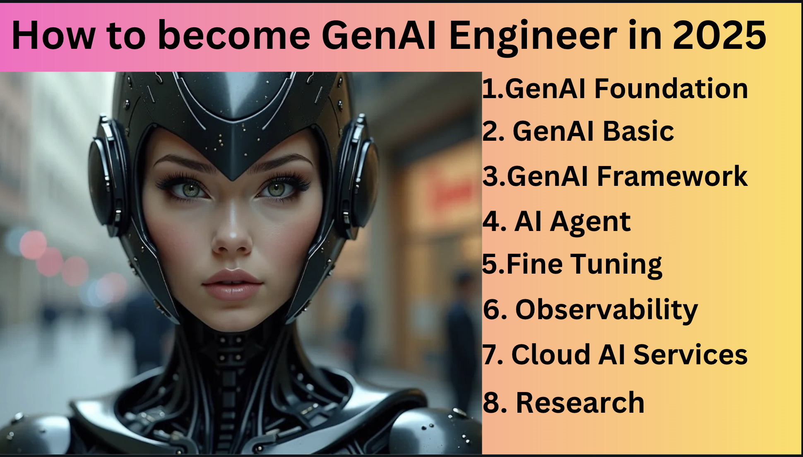

## Free Generative AI Platform/App:
Discover our free generative AI platform where you can ask questions, summarize texts, generate stunning images, and create content like code, stories, and video scripts—all without any installations. 
Dive in and play to understand how AI works, master the art of prompt writing, and build your innovative applications seamlessly. platform like chatgpt, XAI(twitter), Gemini from google, groq.

- [ChatGPT](https://chatgpt.com/)
- [XAI| free $25 credit](https://x.ai/api)
- [Groq](https://console.groq.com/keys)
- [Gemini](https://gemini.google.com/app)
- [Bing](https://www.bing.com/)
- [YOU](you.com)
- [Poe](https://poe.com/)
- [Perplexity](https://www.perplexity.ai/)
  
# GenerativeAI Foundation
A solid foundation in mathematics—covering probability, algebra, and calculus—and proficiency in programming languages like Python or JavaScript are essential for generative AI. While no-code platforms offer accessible solutions, mastering these fundamentals enables you to implement customizations more efficiently.
## Programming
- [Python](https://learn.deeplearning.ai/courses/ai-python-for-beginners/lesson/1/introduction)
- [Python Crash course](https://www.coursera.org/learn/python-crash-course/home/module/1)
- [Generative AI with JavaScript](https://www.youtube.com/playlist?list=PLlrxD0HtieHi5ZpsHULPLxm839IrhmeDk)
- [javascript beginner](https://www.coursera.org/learn/javascript-basics?specialization=javascript-beginner)
## Math [12th basic math requirements]
12th basic math requirements. probability, Linear Algebra, Stats, etc

### Probability and statistics: 
- [Probability and statistics in data science using python](https://www.edx.org/course/probability-and-statistics-in-data-science-using-python-2)
- [Khan Academy for probability](https://www.youtube.com/playlist?list=PLC58778F28211FA19) 
- [Khan Academy for statistics](https://www.youtube.com/watch?v=uhxtUt_-GyM&list=PL1328115D3D8A2566)
- [coursera| Basic statistics](https://www.coursera.org/learn/basic-statistics)
### Algebra:
- [Algebra|3 blue and 1 brown ](https://www.youtube.com/playlist?list=PLZHQObOWTQDPD3MizzM2xVFitgF8hE_ab)

# GenAI 
## Beginner:
 Understand key concepts such as transformers encoder, decoder, and essential AI terminology to grasp how these models work. Gradually learn to use APIs from platforms like OpenAI, Huggingface, and  Claude to build and customize your AI-powered products. This structured approach enables you to implement customizations efficiently in generative AI.
- [Transformers](https://huggingface.co/learn/nlp-course/chapter1/1)
- [Generative AI for Everyone](https://www.coursera.org/learn/generative-ai-for-everyone)
- [Google|Beginner: Introduction to Generative AI Learning Path](https://www.cloudskillsboost.google/paths/118)
- [Microsoft|Generative AI ](https://learn.microsoft.com/en-gb/shows/generative-ai-for-beginners/)

## Prompt: Language to communicate to LLM
Prompt engineering is designing and crafting effective prompts to optimize the performance of large language models (LLMs). 
These courses, such as “Prompt Engineering for Everyone” and OpenAI’s and Anthropic’s collections, guide learners in understanding how to structure prompts, leverage model capabilities, and create customized queries for specific tasks. 
They provide practical techniques, examples, and strategies for improving interaction with LLMs across diverse applications.
- [chatgpt prompt Engineering](https://www.deeplearning.ai/short-courses/chatgpt-prompt-engineering-for-developers/)
- [IBM |Prompt-engineering-for-everyone](https://www.coursera.org/learn/generative-ai-prompt-engineering-for-everyone#modules)
- [Prompting Guide](https://www.promptingguide.ai/prompts)
- [Prompt Collections](https://github.com/f/awesome-chatgpt-prompts)
- [Openai Prompt Collections](https://platform.openai.com/docs/examples)
- [Anthropic collections](https://docs.anthropic.com/en/prompt-library/library)
  

## GenAI Level 2 and Agent Courses
These advanced courses offer a practical deep dive into generative AI frameworks like LangChain, LlamaIndex, and Autogen, emphasizing hands-on projects to build real-world applications. With a focus on agentic systems and retrieval-augmented generation, learners can enhance their expertise and confidently navigate cutting-edge AI technologies. Completing these courses ensures proficiency in key tools and frameworks, setting the stage for impactful development work.
- [Kaggle |5 Day GenAI](https://www.kaggle.com/learn-guide/5-day-genai)
- [Generative ai with llms](https://www.coursera.org/learn/generative-ai-with-llms)
- [LangChain & Vector Databases in Production| Activeloop](https://learn.activeloop.ai/courses/langchain)
- [Haystack](https://www.deeplearning.ai/short-courses/building-ai-applications-with-haystack/)
- [LLmaindex](https://www.deeplearning.ai/short-courses/building-agentic-rag-with-llamaindex/)
- [Functions tools agents langchain](https://www.deeplearning.ai/short-courses/functions-tools-agents-langchain/)
- [Lang Graph](https://www.deeplearning.ai/short-courses/ai-agents-in-langgraph/)
- [Autogen](https://www.deeplearning.ai/short-courses/ai-agentic-design-patterns-with-autogen/)
- [Crew AI](https://www.deeplearning.ai/short-courses/multi-ai-agent-systems-with-crewai/)
- [Crew AI Advanced](https://learn.deeplearning.ai/courses/practical-multi-ai-agents-and-advanced-use-cases-with-crewai/lesson/1/introduction)
- [Llama 3.2](https://www.deeplearning.ai/short-courses/introducing-multimodal-llama-3-2/)
- [Building-systems-with-chatgpt/](https://www.deeplearning.ai/short-courses/building-systems-with-chatgpt/)
- [HuggingFace NLP course](https://huggingface.co/learn/nlp-course/chapter1/1)
- [Smolagents](https://huggingface.co/docs/smolagents/en/index)
- [evaluating-debugging-generative-ai](https://www.deeplearning.ai/short-courses/evaluating-debugging-generative-ai/)
- [langchain for LLM application development/](https://www.deeplearning.ai/short-courses/langchain-for-llm-application-development/)
- [RAG|Nvidia](https://learn.nvidia.com/courses/course-detail?course_id=course-v1:DLI+S-FX-16+V1)

- [Chat with your data](https://www.deeplearning.ai/short-courses/langchain-chat-with-your-data/)
- [Building RAG Agents with LLMs| Nvidia](https://learn.nvidia.com/courses/course-detail?course_id=course-v1:DLI+S-FX-15+V1)
- [OpenAI|Build Hours](https://github.com/openai/build-hours)

## AI Observability | Monitoring: If you can't measure, you can't understand it

These courses focus on AI observability and operational excellence, offering tools and frameworks like Arize, LangSmith, MLflow, and ZenML for monitoring, testing, and managing large language models (LLMs). Learners gain practical insights into LLMOps, quality assurance, and automated testing, ensuring safety and performance in AI applications. With hands-on content and cutting-edge platforms, these courses empower participants to build reliable, scalable, and well-monitored AI systems.
  - [Arize|LLM Observability](https://arize.com/blog-course/large-language-model-monitoring-observability/)
  - [Lang Smith](https://docs.smith.langchain.com/)
  - [Lang Smith| Course](https://academy.langchain.com/enrollments)
  - [MLFlow Wensite](https://mlflow.org/)
  - [mlops mlflow |huggingface|Duke| Course](https://www.coursera.org/learn/mlops-mlflow-huggingface-duke/)
  - [LLM Ops|GCP|Azure|AWS](https://www.coursera.org/specializations/large-language-model-operations)
  - [LLMOps | GOOGLE](https://learn.deeplearning.ai/courses/llmops/lesson/1/introduction)
  - [Automated testing llmops](https://learn.deeplearning.ai/courses/automated-testing-llmops/lesson/1/introduction)
  - [Quality safety LLM Applications](https://learn.deeplearning.ai/courses/quality-safety-llm-applications/lesson/1/introduction)
  - [Agent Ops](https://github.com/AgentOps-AI/AgentStack)
  - [Comet|LLMOPs](https://www.comet.com/site/llm-course/)
  - [Deep Check](https://www.deepchecks.com/llm-evaluation/)
  - [Evidently Ai](https://www.evidentlyai.com/)
  - [MetaFlow](https://github.com/Netflix/metaflow)
  - [BentoML](https://www.bentoml.com/)
  - [ZenML](https://www.zenml.io/)
    

## Image and Video Generation:
These courses and platforms provide an exploration of Multimodal image and video generation using cutting-edge tools like diffusion models, DALL-E, and Runway Gen-2. Learners can master techniques for crafting prompts and experimenting with tools like MidJourney, Sora, and Leonardo.ai to create stunning visual content. With practical experiments and creative freedom, these resources empower users to harness generative AI for artistic and professional projects.
- [Diffusion-models](https://learn.deeplearning.ai/courses/diffusion-models/lesson/1/introduction)
- [Huggingface Diffusion course](https://huggingface.co/learn/diffusion-course/en/unit0/1)
- [DallE prompts](https://mockey.ai/blog/dall-e-prompts/)
- [Mid journey](https://www.midjourney.com/explore?tab=top)
- [Sora](https://sora.com/explore/featured)
- [Runway|Gen2](https://runwayml.com/research/gen-2)
- Experiment with Dalle, Midjourney, Leonardo.ai, Kling, Sora

## Best Free AI Conferences:
Best underrated AI conference free of cost
- [LLM in Production](https://www.youtube.com/playlist?list=PL3vkEKxWd-us5YvvuvYkjP_QGlgUq3tpA)
- [LLM in Production - Part II](https://www.youtube.com/playlist?list=PL3vkEKxWd-uupBSWL-DbVJuCMqXO9Z3Z4)
- [LLM in Production - Part III](https://www.youtube.com/playlist?list=PL3vkEKxWd-usFkc3977ZeexYXS3GgDVSO)
- [MLOPs Community](https://home.mlops.community/home/content)
  
## GenAI Framework, Library, and Tools:
Unlock the full potential of Generative AI with powerful frameworks like **LangChain** and **LlamaIndex**, perfect for seamless integration and advanced functionality. Harness the capabilities of agentic frameworks such as **Langgraph**, **CrewAI**, **Autogen**, and **Phidata** to create autonomous AI systems that handle complex tasks effortlessly. For those who prefer a no-code approach, platforms like **Flowise** and **Langflow** make designing and deploying sophisticated AI applications simple and accessible. Empower your AI journey with these versatile tools and bring your innovative ideas to life with ease.

- [OpenAI Cookbook](https://cookbook.openai.com/)
- [Gemini Cookbook](https://ai.google.dev/gemini-api/cookbook)
- [Langchain](https://python.langchain.com/docs/introduction/)
- [LLamaindex](https://docs.llamaindex.ai/en/stable/#introduction)
- [Haystack](https://haystack.deepset.ai/)
- [Phidata](https://www.phidata.com/)
- [Lang Graph](https://www.langchain.com/langgraph)
- [Workflow](https://docs.llamaindex.ai/en/stable/module_guides/workflow/)
- [OpenAI Swarm](https://github.com/openai/swarm)
- [Crew AI](https://www.crewai.com/)
- [Autogen](https://microsoft.github.io/autogen/0.2/)
- [Pandas AI](https://pandas-ai.com/)
- [Lovable.dev|GPT Engineer](https://pandas-ai.com/)
- [Flowise](https://flowiseai.com/)
- [Langflow](https://www.langflow.org/)
- [Llama Stack](https://github.com/meta-llama/llama-stack)
- [LLM Course](https://github.com/mlabonne/llm-course)

### Fine-tuning: Teach our AI a new Subject
These courses focus on fine-tuning large language models (LLMs) to specialize them for new subjects or tasks. Learners explore tools and techniques for customizing models, including embedding fine-tuning and debugging generative AI systems. With hands-on resources from OpenAI, Activeloop, and DeepLearning.ai, these courses empower users to adapt LLMs to specific domains for improved accuracy and relevance.
- [Fine tuning LLM](https://www.deeplearning.ai/short-courses/finetuning-large-language-models/)
- [Activeloop| Fine tuning](https://learn.activeloop.ai/courses/llms)
- [OpenAI  Fine tuning](https://platform.openai.com/docs/guides/fine-tuning)
- [Evaluating Debugging Generative-ai](https://www.deeplearning.ai/short-courses/evaluating-debugging-generative-ai/)
- [Fine tuning Embedding](https://gpt-index.readthedocs.io/en/latest/examples/finetuning/embeddings/finetune_embedding.html)
## Research:
These research-focused resources provide access to cutting-edge advancements in AI from leading organizations like OpenAI, DeepMind, and Google Research. Platforms like Arxiv and Hugging Face Papers offer a wealth of scholarly articles, enabling learners to explore the latest innovations in AI agents, generative models, and more. Staying updated with these resources is essential for those aiming to contribute to or stay ahead in the evolving AI landscape.
- [Arxiv](https://arxiv.org/search/?query=AI+agent&searchtype=all&abstracts=show&order=-announced_date_first&size=50)
- [Hugging Face Paper](https://huggingface.co/papers)
- [OpenAI Research](https://openai.com/news/research/)
- [Meta](https://research.facebook.com/)
- [Google Research](https://research.google/)
- [Deep Mind](https://deepmind.google/research/)
- [Anthropic](https://www.anthropic.com/research)
## Book And reading resources:
- [OpenAI| Best resources on GenAI](https://github.com/openai/openai-cookbook)
- [LLM Patterns](https://eugeneyan.com/writing/llm-patterns/)
- [introduction to large language models](https://docs.cohere.com/docs/introduction-to-large-language-models)
- [KDnuggest| Nice resource](https://www.kdnuggets.com/)
- [MLOps](https://huyenchip.com/mlops/)
- [Langchain Usecase](https://python.langchain.com/docs/use_cases/)
- [LLM Auto Eval Best Practices RAG](https://www.databricks.com/blog/LLM-auto-eval-best-practices-RAG?utm_source=bambu&utm_medium=social&utm_campaign=advocacy&blaid=5058202)
- [Hugging Face| Cookbook](https://huggingface.co/learn/cookbook/en/index)
- [Evaluating-with-llms](https://mlflow.org/docs/latest/models.html#evaluating-with-llms)
-  [Best Fine-tuning- Unsloth](https://github.com/unslothai/unsloth)
-  [Best fine-tuning- Auto Train](https://huggingface.co/autotrain)
-   [LLaMA-Factory](https://github.com/hiyouga/LLaMA-Factory)
 
## UI and Local LLM  for POC
Build stunning AI applications effortlessly using simple UI libraries like Streamlit and Chainlit for your proof-of-concept projects. Harness powerful local LLMs such as Ollama, LMStudio, and VLLM for advanced text generation, while creating scalable backend services with FastAPI. Tap into the extensive collection of open-source models from Hugging Face to bring your Generative AI ideas to life
- [Hugging face](https://huggingface.co/models)
- [Langchain](https://python.langchain.com/docs/get_started/introduction)
- [Llamaindex](https://www.llamaindex.ai/)
- [Unstructured-IO](https://github.com/Unstructured-IO/unstructured)
- [Chainlit](https://docs.chainlit.io/get-started/overview)
- [Streamlit](https://docs.streamlit.io/)
- [text-generation-webui](https://github.com/oobabooga/text-generation-webui)
- [LMstudio](https://lmstudio.ai/)
- [Anything LLM](https://anythingllm.com/)
- [Ollama](https://ollama.com/)
- [vllm](https://github.com/vllm-project/vllm)
- [FastAPi](https://fastapi.tiangolo.com/)
 

## Readymade API-based/self-hosted LLM platform
- [Gemini](https://ai.google.dev/gemini-api/docs/api-key)
- [Together AI](https://www.together.ai/)
-  [Anyscale](https://www.anyscale.com/)
-  [Replicate](https://replicate.com/)
- [Deepinfra](https://deepinfra.com/)
- [Hugging face| open source](https://huggingface.co/models)
 
## Cloud Services:
These cloud services courses focus on leveraging platforms like AWS Bedrock, Azure AI, and GCP Vertex AI for deploying and managing AI solutions at scale. Learners gain practical knowledge in using cloud-based tools for building, fine-tuning, and operationalizing large language models (LLMs). With a strong emphasis on hands-on implementation, these resources prepare participants to harness the power of AI in enterprise-grade cloud environments.
- [AWS| Bedrock](https://www.coursera.org/learn/amazon-bedrock-getting-started)
- [Azure| AI Services](https://learn.microsoft.com/en-us/training/paths/get-started-azure-ai/)
- [Azure| AI Services 2](https://learn.microsoft.com/en-us/training/modules/introduction-to-azure-ai-studio/)
- [GCP|Vertex | Gemini](https://www.cloudskillsboost.google/paths/1282)
- [LLMOPS](https://www.coursera.org/specializations/large-language-model-operations)

# GenAI Apps and Projects:
## Chunking Strategy:
- [chonkie](https://github.com/chonkie-ai/chonkie/tree/main)
- [semchunk](https://github.com/umarbutler/semchunk)
- [Llamaindex|Chunking](https://docs.llamaindex.ai/en/stable/examples/node_parsers/semantic_chunking/)
- [Langchain Chunkinig](https://js.langchain.com/v0.1/docs/modules/data_connection/document_transformers/)
- [Unstructuredio| Chunking](https://docs.unstructured.io/open-source/core-functionality/chunking)
 ## Vector DB
- [openai Vector DB implementation](https://github.com/openai/openai-cookbook/tree/main/examples/vector_databases)
- [Vector DB](https://thedataquarry.com/posts/vector-db-1/)
- [Chroma DB|open source|local](https://www.trychroma.com/)
- [Pinecone Example](https://docs.pinecone.io/page/examples)
- [Weaviate DB|open source|local](https://weaviate.io/)
- [Milvus](https://milvus.io/)

## RAG and Evaluation:
- [Azure AI search](https://techcommunity.microsoft.com/blog/azure-ai-services-blog/azure-cognitive-search-and-langchain-a-seamless-integration-for-enhanced-vector-/3901448)
- [RAG|Nvidia](https://learn.nvidia.com/courses/course-detail?course_id=course-v1:DLI+S-FX-15+V1)
- [RAGFlow](https://github.com/infiniflow/ragflow)
- [Verba](https://github.com/weaviate/Verba)
- [Graphrag](https://microsoft.github.io/graphrag/)
- [RAG evaluation | Course](https://www.deeplearning.ai/short-courses/building-evaluating-advanced-rag/)
- [Arize|RAG evaluation/](https://arize.com/blog-course/rag-evaluation/)

- ## Router models:
- [Router LLM](https://github.com/lm-sys/RouteLLM)
- [ModernBERT](https://github.com/AnswerDotAI/ModernBERT/tree/main)

## Best Notebook:
- [Autogen](https://microsoft.github.io/autogen/0.2/docs/Examples)
- [openAI](https://github.com/openai/openai-cookbook/tree/main/examples)
- [Anthropic Cookbook](https://github.com/anthropics/anthropic-cookbook)
- [Build Hours](https://github.com/openai/build-hours)
- [Awesome-llm-apps](https://github.com/Shubhamsaboo/awesome-llm-apps)
- [LLM Course](https://github.com/mlabonne/llm-course)

## Other projects:
- [OpenHands](https://github.com/All-Hands-AI/OpenHands)
- [Eliza](https://github.com/elizaOS/eliza)
- [Fish Speech](https://github.com/fishaudio/fish-speech)
- [Anythingllm](https://anythingllm.com/)
- [Open Canvas](https://github.com/langchain-ai/open-canvas)
- [Awesome-llm-apps](https://github.com/Shubhamsaboo/awesome-llm-apps)
- [Khoj](https://github.com/khoj-ai/khoj)
- [Awesome generative-ai](https://github.com/steven2358/awesome-generative-ai)

## Leaderboard
- [MTEB Leaderboard](https://huggingface.co/spaces/mteb/leaderboard)
- [SLM](https://llm.extractum.io/list/?small)
- [SLM 2](https://huggingface.co/spaces/open-llm-leaderboard/open_llm_leaderboard#/?params=0%2C9)
- [Open LLM](https://huggingface.co/spaces/open-llm-leaderboard/open_llm_leaderboard#/)
- [LMArena](https://lmarena.ai/)
- [LLM compare](https://yourgpt.ai/tools/llm-comparison-and-leaderboard)
- [Vellum|Leaderboard](https://www.vellum.ai/llm-leaderboard)
